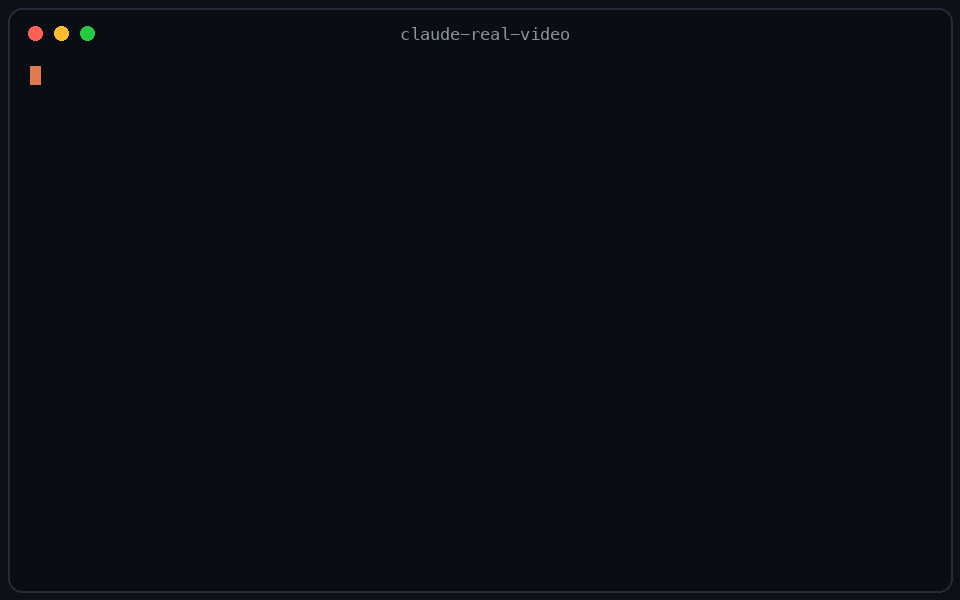

# claude-real-video

[](https://pypi.org/project/claude-real-video/) [](https://pypi.org/project/claude-real-video/) [](LICENSE) [](https://news.ycombinator.com/item?id=48766005)

**Let Claude — or any LLM — actually watch a video.**



> Same 58-second clip: fixed 1 fps sampling = **58 frames**. crv keeps the **26 that actually differ** — and `--grid` packs them into **3 contact sheets**. Fewer tokens, nothing missed.

> **This free version lets your AI *see* the video.** [crv Pro](https://leoaido.com/crv-pro/) lets it *understand* it — how it was shot (cut rhythm, camera moves) plus a timestamped timeline of what frames can't show: gestures, expressions, voice pitch shifts, emotion, sound events. One-time founder price $19 — [get it on Capafy](https://capafy.ai/agent/llm-real-video-pro-let-any-llm-watch-videos/5451082151).

Most AI tools don't really *see* a video. Paste a YouTube link into ChatGPT and it
reads the **transcript**, not the picture. Claude won't take a video file at all.
Even Gemini, which *can* read video natively, has to send it up to Google and
samples frames at a **fixed interval** (1 fps by default), so fast cuts slip past.

`claude-real-video` does it differently, and **the processing runs locally**: point it at a URL or a
file, and it pulls the frames that *actually matter* (every scene change, not a
fixed quota), throws away the near-duplicates, transcribes the audio, and hands
you a clean folder any LLM can read. All the processing happens on your own machine — what gets sent anywhere is only the frames/text *you* choose to paste into an LLM afterwards.

```bash
crv "https://www.youtube.com/watch?v=..."
# → crv-out/frames/*.jpg  +  crv-out/transcript.txt (+ transcript.json with timestamps)  +  crv-out/MANIFEST.txt
```

Then drop the frames + `MANIFEST.txt` into Claude / ChatGPT / Gemini and ask away.

**No terminal needed** — run `crv-web` and a local page opens (Traditional Chinese / Simplified Chinese / English): paste a YouTube or Reels link or a file path, click Analyze, open the result viewer. Runs 100% locally, nothing uploaded.

Want to eyeball what the model will see first? Add `--viewer` — it writes a local `viewer.html` (video + keyframe grid + transcript) you can double-click open. No network, no extra installs.

**Slow-changing content** (animation tutorials, gradual morphs, slow pans): add `--adaptive` — frames are picked against their rolling neighbourhood instead of a fixed threshold, so a 2-3s squash-and-stretch that never spikes any single frame still gets captured.

**Text-heavy content** (lecture slides, screen recordings, talking-head explainers): add `--text-anchors` — extra frames are forced at subtitle-cue timestamps, so each spoken segment gets a matching visual even when the scene barely changes. Needs a sidecar `.srt`/`.vtt` or an embedded subtitle track — captions burned into the pixels can't be detected. At most one forced frame per second; scene detection is untouched.

Not doing LLM work? It also works as a **general-purpose video keyframe extractor** —
scene-change detection + dedup, no ML models to download.

**Using Claude Code?** Install it as a skill so Claude watches videos on its own
(the `skills/` folder lives in the repo, not in the pip package — clone it first):

```bash
pip install "claude-real-video[whisper]"
git clone https://github.com/HUANGCHIHHUNGLeo/claude-real-video.git
mkdir -p ~/.claude/skills && cp -r claude-real-video/skills/claude-real-video ~/.claude/skills/
```

Then just paste a video link into Claude Code and ask about it.

**New in 0.3.0** — tell it *why* you're watching, and keep what it finds:

```bash
crv "https://youtu.be/..." --why "find the pricing strategy" --kb ~/notes
```

`--why` makes the analysis focus on what you care about instead of a generic summary;
`--kb` saves the result as a dated note in your own notes folder, so it doesn't die in `crv-out`.

---

## Why not just sample frames?

Most "let an LLM watch a video" scripts (and Gemini's own pipeline) grab frames
at a **fixed interval** — e.g. one per second. That over-samples a static
screencast and under-samples a fast-cut reel. `claude-real-video` is smarter:

| | fixed-interval sampling | **claude-real-video** |
|---|---|---|
| Frame selection | every N seconds | **scene-change detection** + density floor |
| Repeated shots (A-B-A cuts) | sent again every time | **sliding-window dedup** sends each shot once |
| Static slide (10 min) | ~600 near-identical frames | **collapses to 1** (dedup) |
| Fast-cut reel | misses frames between samples | catches each visual change |
| Audio | often ignored | Whisper transcript w/ language detect |
| Where the processing happens | often in someone's cloud | **on your machine** (you choose what to share with an LLM afterwards) |
| Input | usually local file only | **URL (yt-dlp) or local file** |

You feed the model *fewer, more meaningful* frames — cheaper context, better
understanding.

---

## Install

```bash
pip install "claude-real-video[whisper]"   # recommended: frames + dedup + audio transcription
pip install "claude-real-video[motion]"    # camera-move + rhythm analysis (--motion)
pip install "claude-real-video[whisper,motion]"  # both
pip install claude-real-video              # core only (frames + dedup)
```

pip extras never install themselves — without `[whisper]` there is **no speech-to-text**
(videos that ship their own subtitles still get a transcript), and without `[motion]`
the `--motion` / `--chapters` / `--poster` flags report a clean "OpenCV required" error.

### System requirement: ffmpeg

`ffmpeg` / `ffprobe` are used for frame extraction and audio, and aren't
pip-installable. Install them once:

| OS | command |
|---|---|
| **macOS** | `brew install ffmpeg` |
| **Linux** | `sudo apt install ffmpeg` (or your distro's package manager) |
| **Windows** | `winget install Gyan.FFmpeg` — or `choco install ffmpeg` — or [download a build](https://www.gyan.dev/ffmpeg/builds/) and add its `bin\` folder to your `PATH` |

Verify it's on your `PATH`:

```bash
ffmpeg -version
```

Transcription uses the `whisper` CLI (installed by the `[whisper]` extra, or
`pip install openai-whisper`). Whisper also relies on ffmpeg.

Works on **macOS, Windows, and Linux** — Python 3.10+.

---

## Usage

```bash
# A YouTube / Instagram / TikTok / ... link
crv "https://www.instagram.com/reel/XXXX/"

# A local file, English transcript, output to ./out
crv lecture.mp4 -o out --lang en

# Frames only, no transcription
crv clip.mp4 --no-transcribe

# A login-gated video (your own / authorised use): pass a Netscape cookie file
crv "https://..." --cookies cookies.txt
```

`python -m claude_real_video ...` works as an alias for `crv` too.

### Motion — tell the model *how* it moves, not just what's on screen

Keyframes tell an LLM what's on screen. Not how it moves. The core tool gives a
model scene-aware frames and a transcript — enough to know what a video is about.
But a stack of stills drops the two things that make video *video*: motion and
pacing. A model can't tell a slow push-in from a frantic handheld chase, or a
snappy edit from a lingering one, when all it sees is disconnected images.

Add `--motion` (needs the `[motion]` extra — OpenCV, no ML models, no cloud) and
it adds three things, all as plain text in the same `MANIFEST.txt`:

- **Camera-move classification** — every shot labelled `static` / `pan-left` /
  `pan-right` / `tilt-up` / `tilt-down` / `zoom-in` / `zoom-out` / `handheld`,
  estimated from a global affine transform per frame pair.
- **Editing rhythm** — full shot list with durations, cuts per minute, and how
  the pacing shifts across the open, middle and close. Ask your AI *why* an edit
  feels fast, and it answers with numbers.
- **Action bursts** — high-motion shots automatically get 0.2s-apart frame
  sequences (`burst_shotNN_*.jpg`), so the model reads movement as a progression
  instead of guessing what happened between two keyframes.

```bash
crv "https://youtu.be/..." --motion --chapters --poster
```

A machine-readable `motion.json` (shots, rhythm, chapters) is also written for
your own tools. `--chapters` derives an auto chapter list labelled by the
transcript at each chapter start; `--poster` picks the sharpest representative
lead frame (`poster.jpg`) so the model reads the best frame first.

Real output (abridged):

```
--- motion analysis --
editing rhythm: 14 shots | 21.0 cuts/min | avg 2.8s (median 2.1s, range 0.8-9.4s)
cuts by thirds (open/middle/close): 7 / 4 / 3
shots:
  #01  0.00-2.10s  (2.10s) camera: pan-right   motion: high (12.3%W/s) burst: burst_shot01_1..4
  #02  2.10-4.80s  (2.70s) camera: zoom-in     motion: medium (3.1%W/s)
  #03  4.80-9.20s  (4.40s) camera: static      motion: low (0.2%W/s)
```

Everything runs locally with ffmpeg + OpenCV. No ML models to download, no cloud
uploads.

### Options

| flag | default | meaning |
|---|---|---|
| `-o, --out` | `crv-out` | output directory |
| `--overwrite` | off | replace a previous analysis living in the output directory (without this, a non-empty output dir is refused to avoid mixing videos) |
| `--scene` | `0.30` | scene-change sensitivity (lower = more frames) |
| `--fps-floor` | `1.0` | at least one frame every N seconds |
| `--max-frames` | `150` | hard cap on total frames |
| `--adaptive` | off | adaptive scene detection: catches slow morphs (2-3s squash/stretch, gradual pans) a fixed threshold misses, by comparing each frame against its rolling neighbourhood |
| `--text-anchors` | off | force extra frames at subtitle-cue timestamps (sidecar `.srt`/`.vtt` or embedded track) — for videos where meaning changes faster than pixels; at most one forced frame per second |
| `--lang` | `auto` | Whisper language (`en`, `zh`, `auto`, ...) |
| `--whisper-model` | `base` | Whisper model for transcription (`tiny`/`base`/`small`/`medium`/`large` — base is fast; medium/large for tricky audio, they download more and run slower) |
| `--dedup-threshold` | `8` | % of pixels that must change for a frame to count as new; higher = fewer frames |
| `--dedup-window` | `4` | compare against the last N kept frames — a shot the model already saw doesn't come back after a cutaway (`1` = consecutive-only) |
| `--report` | off | keep dropped frames in `./dropped` + write `report.html` visualising every keep/drop decision |
| `--no-transcribe` | off | skip audio |
| `--keep-audio` | off | also save the **full soundtrack** (`audio.m4a`) so audio models can *hear* it |
| `--viewer` | off | also write `viewer.html` — browse the video, keyframes and transcript in one local page (double-click to open) |
| `--motion` | off | motion analysis: label every shot's camera move, add an editing-rhythm summary, and write 0.2s-apart action-burst frames for high-motion shots. Plain text in `MANIFEST.txt` + `motion.json`. Needs the `[motion]` extra (OpenCV) |
| `--motion-fps` | `5.0` | frame-sampling rate for motion analysis (higher = more precise, slower) |
| `--burst-gap` | `0.2` | spacing in seconds between action-burst frames for high-motion shots |
| `--max-burst-frames` | `12` | cap on burst frames written per high-motion shot |
| `--high-motion-pct` | `8.0` | motion level (%W/s) above which a shot gets an action burst |
| `--chapters` | off | also derive an auto chapter list (reuses the shot boundaries) labelled by the transcript at each start; written into `MANIFEST.txt` and `motion.json`. Implies the motion pipeline |
| `--poster` | off | also pick a representative lead frame (`poster.jpg`) — the sharpest, most informative kept frame |
| `--grid` | off | also tile the kept frames into 3x3 contact sheets (`./grids`) — consecutive frames side by side help the model follow motion and progression |
| `--why` | – | why you're watching, e.g. `--why "find the pricing strategy"` — written into `MANIFEST.txt` so the model analyses with that lens instead of a generic summary |
| `--kb` | – | also save the analysis as a dated markdown note into this folder (your Obsidian vault, notes dir, ...) — so it joins your knowledge base instead of dying in `crv-out` |
| `--cookies` | – | Netscape cookie file for login-gated sources |
| `--cookies-from-browser` | – | read login cookies straight from your own browser — `chrome`, `safari`, `firefox` or `edge` (your own account only) |

---

### What `--grid` output looks like

One contact sheet = nine consecutive keyframes, in order, filenames on each cell — the model reads a sequence, not scattered stills:


## Use it from Python

```python
from claude_real_video import process

r = process("https://youtu.be/...", "out", lang="en")
print(r.frame_count, r.transcript_path)
```

---

## How it works

1. **Fetch** — `yt-dlp` for URLs (optional cookies), or copy a local file.
2. **Extract** — one chronological `ffmpeg select` pass grabs every scene change
   *plus* a density floor (at least one frame every `--fps-floor` seconds), so
   fast cuts and slow screencasts are both covered.
3. **Dedup** — real pixel difference (downscaled RGB, not a perceptual hash — hashes
   go blind on flat colours and equal-luma hue changes) against a **sliding window**
   of the last `--dedup-window` kept frames, so an A-B-A cutaway doesn't re-send a
   shot the model has already seen. `--report` writes `report.html` showing every
   keep/drop decision with its diff %, for tuning.
4. **Text** — if the video **already has subtitles** (a sidecar `.srt`/`.vtt` next to a
   local file, or an embedded subtitle track), those are used as the transcript —
   faster and more accurate than re-transcribing. Only when there are no subtitles
   does it fall back to **Whisper** on the audio (skipped cleanly if there's no audio).
5. **Audio** *(optional, `--keep-audio`)* — save the **full original soundtrack**
   (`audio.m4a`: music + speech + effects, copied losslessly when possible). The
   transcript only has the *words*; the audio file lets a model that can listen
   (Gemini, GPT-4o, …) actually *hear* the music and tone.
6. **Manifest** — `MANIFEST.txt` summarises everything for the model.

So the model can **see** (key frames), **read** (transcript) and — with `--keep-audio` —
**hear** (full soundtrack) the video. The transcript is plain text any model can read;
the tool **doesn't burn subtitles into the video** — burning is a presentation choice,
not something needed to make a video AI-readable.

---

## Notes

- Only download content you have the right to. The `--cookies` option is for
  your own, authorised access — don't ship credentials in a repo.
- Use one output folder per video. Re-running into a folder that already holds
  an analysis is refused (so two videos never mix); pass `--overwrite` to replace it.

## crv Pro — understand *how* a video was shot, and *why* it works

**The free version (with `--motion`) tells your AI what's on screen *and* how it moves** — camera-move classification, editing rhythm, and action bursts, all computed locally with OpenCV. **crv Pro goes further**: it adds the things frames and motion vectors can't hear or feel, plus a one-flag teardown report.

This free tool tells an LLM **what** is on screen and **how** the camera moved. It can't tell your AI *why* a cut lands, or *what* the speaker's face and voice were doing off-mic.

**crv Pro** adds everything the free version can't perceive:

- **Perception timeline** — the subtle things frames can't show: gestures and expressions (a smile, a hand raised, pointing), voice pitch rises and pauses, speaker emotion, and non-speech sound events — all timestamped
- **A breakdown report** — hook analysis, pacing curve, camera language, and a rubric your own LLM completes into a full teardown
- **Three modes** — `--mode watch` (understand the content), `--mode creator` (reverse-engineer the making), `--mode full`
- *Plus* the camera-move / editing-rhythm / action-burst analysis the free `--motion` flag already provides — Pro reuses and builds on it

**Recent Pro updates** (July 2026): a music-state timeline (hear the score building, peaking, falling away — with BPM), voice emotion read from the isolated voice instead of the full mix, an interactive `--viewer` dashboard with a clickable synced timeline, and richer gesture narration ("hand raised — right hand, while walking toward frame right").

All as plain text in the same manifest, all computed on your machine. One-time founder price **$19**:

- **Buy on Capafy** (instant download, license key included): https://capafy.ai/agent/llm-real-video-pro-let-any-llm-watch-videos/5451082151
- Product page & demo: https://leoaido.com/crv-pro/

---

**Following the build?** I'm documenting the road from open-source tool to first paying customer, in public — [@LeoAidoAI on X](https://x.com/LeoAidoAI).

## License

MIT
